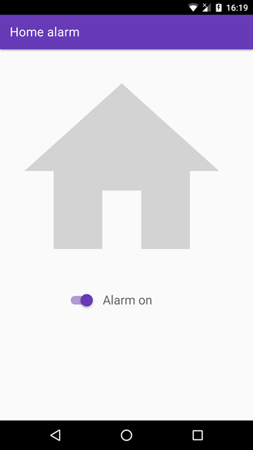

domo-alarm
==========

A home alarm built on top of Domoticz
=====================================

Domo-alarm is a set of programs that interface
with [Domoticz](https://www.domoticz.com) to implement a simple home
alarm.

I decided to write Domo-alarm in
the [Rust programming language](http://rust-lang.org) to teach me some
Rust and start learning about its libraries (Clap, Hyper, Iron,
Lettre, Reqwest, etc).

License
-------

Domo-alarm is licensed under the GNU GPL version 2 license.

Screenshot
----------

Build instructions
------------------

Domo-alarm is built with [Cargo](http://doc.crates.io/guide.html):

    $ cargo build --release

This command should generate two binaries in `target/release`. The
first program, named `domo-alarm-webapp`, is a mobile-friendly web
application which is used to enable or disable the alarm. The second
program, named `domo-alarm-sender`, is invoked by Domoticz to send an
email and ring a siren (or more generally turn on a switch).

Installation and configuration
------------------------------

I suggest to install the `domo-alarm-sender` and `domo-alarm-webapp`
programs in the Domoticz
[scripts](https://www.domoticz.com/wiki/Domoticz_and_Scripting)
directory. The [domo-alarm.conf](./domo-alarm.conf) configuration file
should be copied to `/etc`.

You should edit the configuration file and set the parameters
for sending notifications via emails.

The next step is to configure Domoticz.

Then, you need to create a virtual alarm switch that will store the
status of the virtual alarm (enabled or disabled). To create a virtual
switch, you have to create a "dummy" hardware and then go to the
"switches" tab to create a virtual switch. Take note of the resource
ID of your virtual alarm switch and set the `input_rid` parameter in
`domo-alarm.conf` to this value. Also set the `output_rid` parameter
with the resource ID of the siren you want to ring.

In Domoticz, you should also configure your sensors to invoke a script
which is a wrapper for the `domo-alarm-sender` program. The purpose of
the wrapper is to pass the sensor name to `domo-alarm-sender`. A
sample script can be found [here](domo-alarm-example-sensor.sh).

The webapp is a daemon and that should be started by your init
system. A sample [systemd service](domo-alarm.service) file is
provided.
